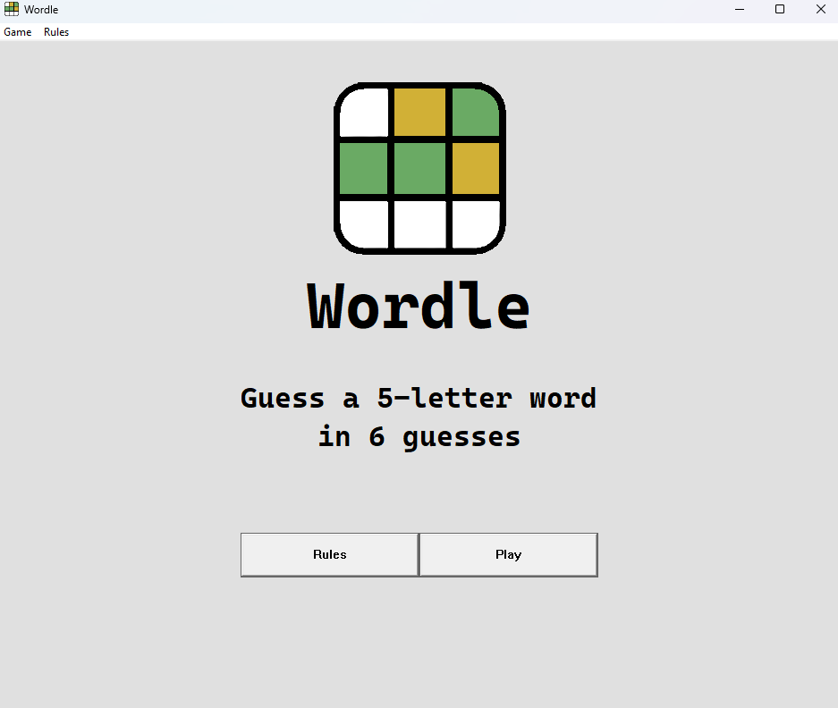
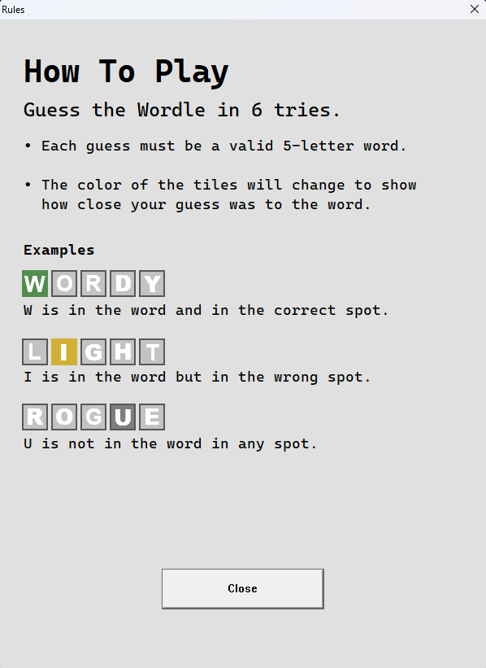
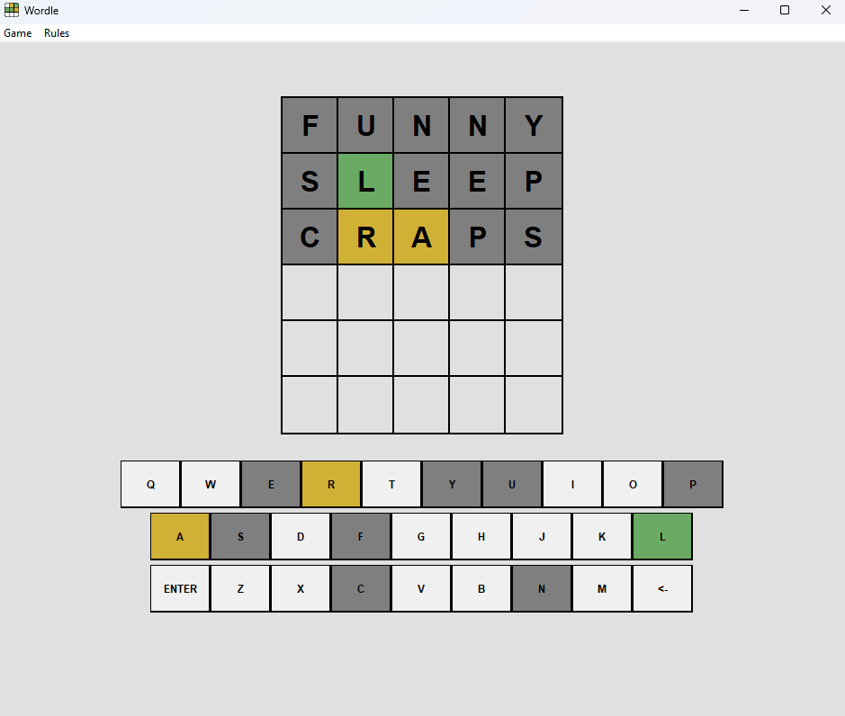
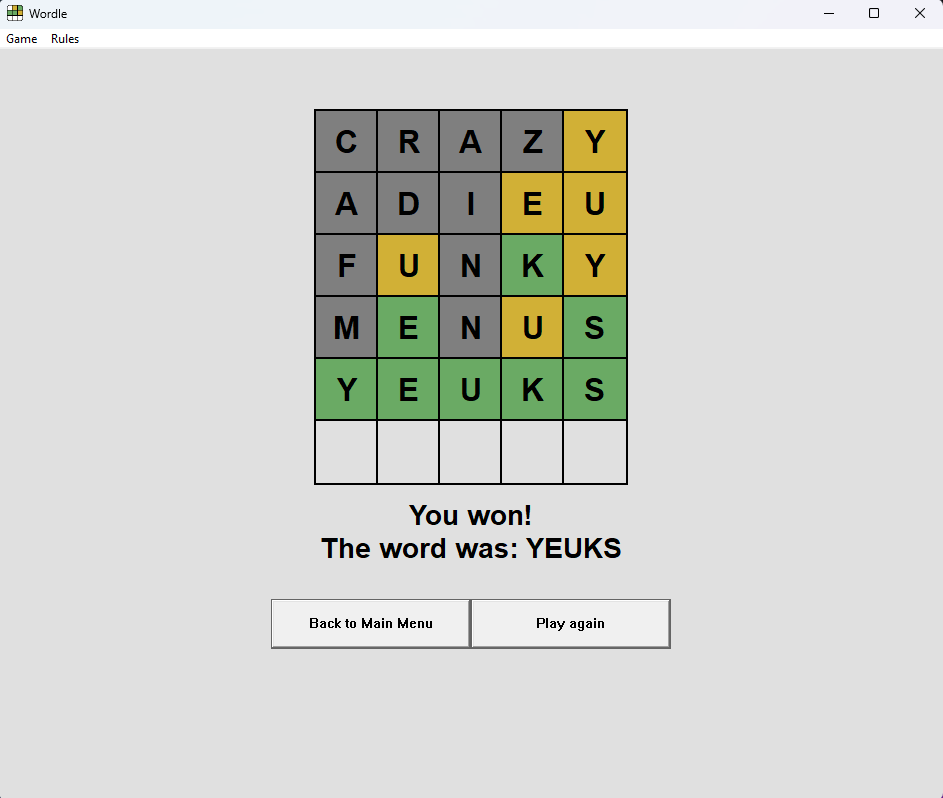

# Windows API 2025
Wordle game is my final project for the Windows API subject.

# About the game

This project is a simple recreation of a Wordle game according to [New York Times wordle](https://www.nytimes.com/games/wordle/index.html) game. It has a simple main menu, rules window, and interactive gameplay. You can enter guesses using either your mouse or keyboard. The on-screen keyboard is colored appropriately to indicate whether each letter is correct, present in the word, or absent.

# Downloading
You can download the game [here](https://drive.google.com/file/d/1TrYz8sq2LDNL51jp-JAp9iuIfAQw8rF7/view?usp=sharing).

# Running
First you need to extract the project's zip file.

Then to run the game you simply need to open `Wordle.exe` file.

# Examples
Below some screenshots of the game are displayed:

## Main menu

## Game Rules

## Mid game screen

## Game won screen
